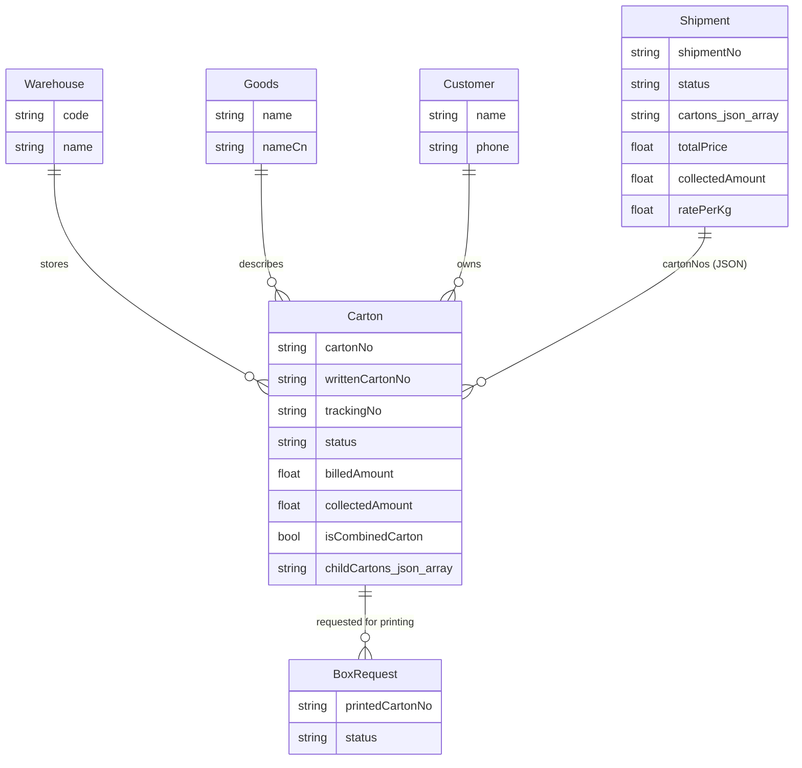
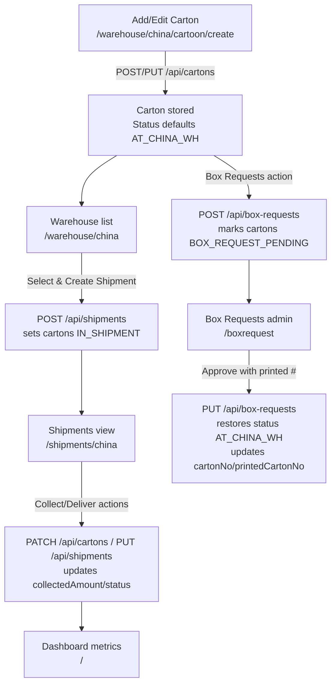

# Database & Flow Overview

## Schema (SQLite via Prisma)

- ER diagram

- **Warehouse** (`id`, `code` unique, `name`, `country?`, `address?`, `isActive`, timestamps)
  - 1:N **Carton**
- **Goods** (`id`, `name` unique, `nameCn?`, `shippingMark?`, `isActive`, timestamps)
  - 1:N **Carton**
- **Customer** (`id`, `name` unique, `phone?`, `notes?`, timestamps)
  - 1:N **Carton**
- **Carton**
  - Keys: `id`
  - Identities: `cartonNo`, `writtenCartonNo` (unique), `trackingNo` (unique)
  - Metrics: `unitPcs?`, `weightKg?`, `lengthCm?`, `widthCm?`, `heightCm?`, `cbm?`
  - Billing: `unitPrice?`, `currencyCode` default USD, `billedAmount` (default 0), `collectedAmount` (default 0)
  - Status: `status` (default `AT_CHINA_WH`), `deliveredAt?`
  - Flags/structure: `isCombinedCarton` (default false), `childCartons` (JSON string list), `printedCartonNo?`
  - Meta: `packNo?`, `shippingMark?`, `remarks?`, `copyNumber?`, `notes?`
  - FKs: `goodsId` → Goods, `warehouseId?` → Warehouse, `customerId?` → Customer
  - Relations: 1:N **BoxRequest**
- **Shipment**
  - Keys: `id`, `shipmentNo` unique
  - Routing: `fromWarehouse?`, `toWarehouse?`, `plannedShipDate?`
  - Financials: `totalPrice` (default 0), `collectedAmount` (default 0), `ratePerKg` (default 0)
  - Cartons: `cartons` JSON string array of carton numbers
  - Status: `status` (default `PLANNED`)
  - Timestamps
- **BoxRequest**
  - Keys: `id`
  - FKs: `cartonId` → Carton
  - Fields: `printedCartonNo?`, `notes?`, `status` (default `PENDING`), timestamps

## Data flow (high level)

## Screen → API map

- `/warehouse/china` → `GET /api/cartons`, `POST /api/shipments`, `POST /api/box-requests`
- `/warehouse/china/cartoon/create` → `GET/POST/PUT /api/cartons`, `GET /api/warehouses`
- `/shipments/china` → `GET /api/shipments`, `PATCH /api/cartons` (collect/deliver), `PUT /api/shipments` (deliver)
- `/boxrequest` → `GET /api/box-requests`, `PUT /api/box-requests`
- `/` (dashboard) → `GET /api/shipments`, `GET /api/cartons`, `GET /api/box-requests`

## Notable behaviors

- Cartons seeded with `billedAmount`, but shipment creation backfills billing using `billedAmount` or `weightKg * ratePerKg`.
- Approving a box request overwrites `cartonNo`/`printedCartonNo` and resets status to `AT_CHINA_WH`.
- Shipment creation sets cartons to `IN_SHIPMENT`; delivering a shipment sets cartons to `DELIVERED` with `deliveredAt`.
